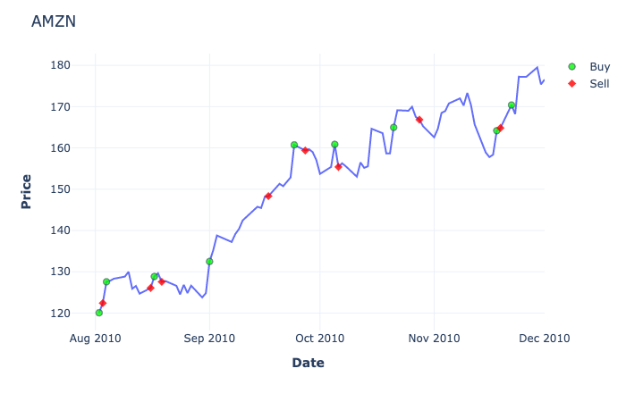
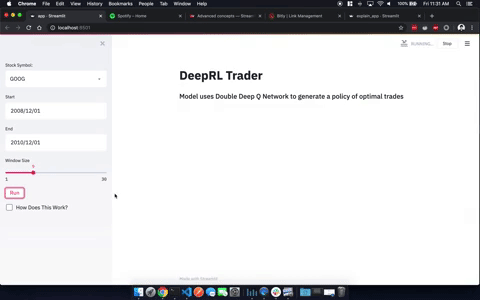
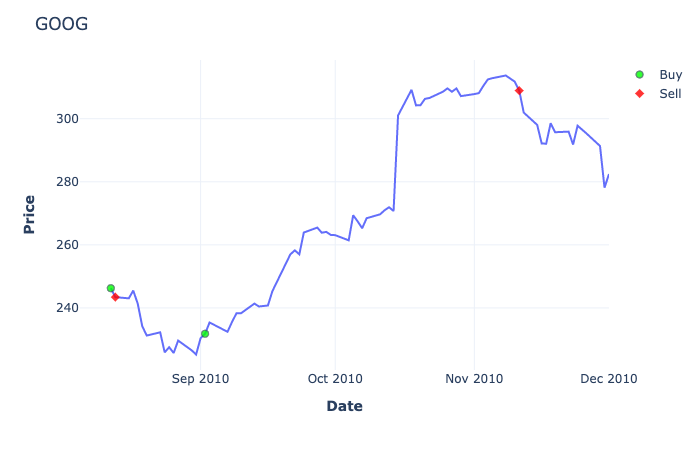
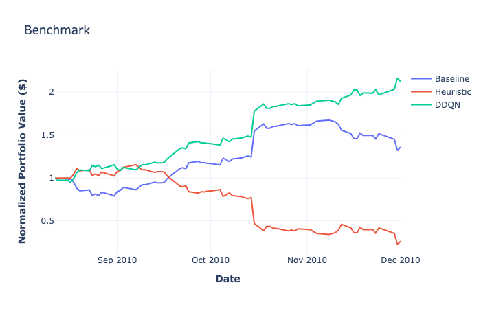
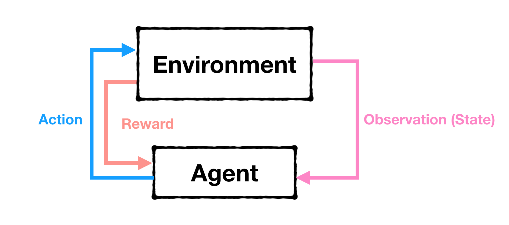
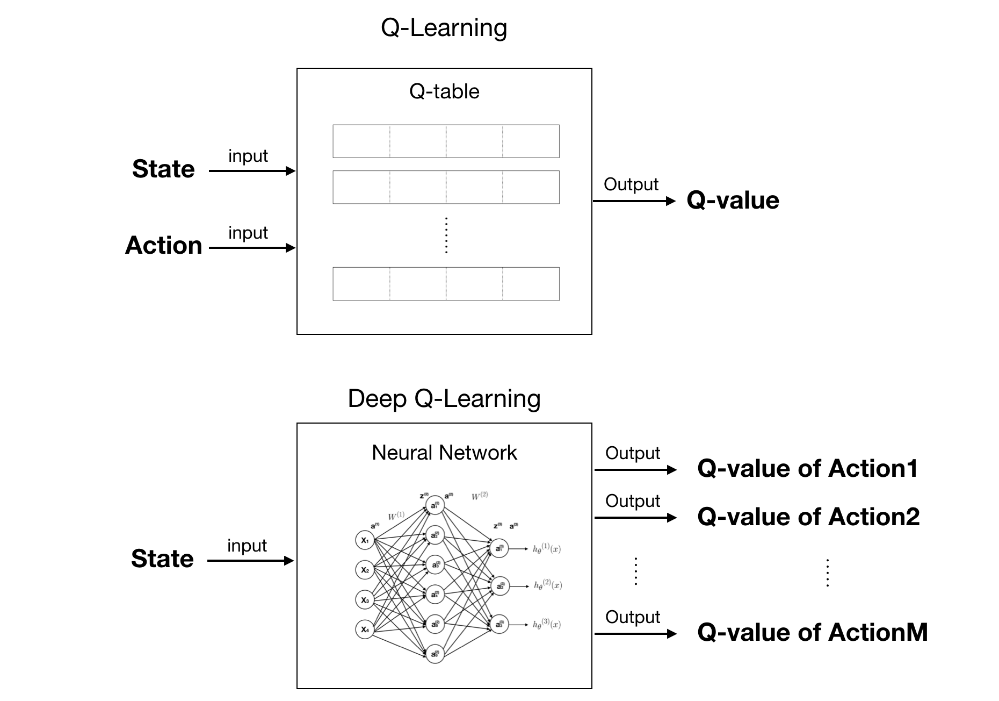

# DeepRL Trader

This application uses a deep reinforcement learning model [**Double Deep Q Network**](https://arxiv.org/abs/1509.06461) to generate an optimal set of trades that maximizes daily return.

## Main Idea



 This application takes a model free approach and develops a variation of Deep Q-Learning to estimate the optimal actions of a trader.

 The model is a FCN trained using *experience replay* and *Double DQN* with input features given by the current state of the limit order book, 33 additional technical indicators, and available execution actions, while the output is the Q-value function estimating the future rewards under an arbitrary action.

 We apply the model to ten stocks and observe that it does on occasion outperform the standard benchmark approach on most stocks using the measure of [**Sharpe Ratio**](https://www.investopedia.com/terms/s/sharperatio.asp).


#### Presentation Slides

Further details regarding the motivation, methods and results of implementation can be found in my presentation [here](http://bit.ly/Aaron-Mendonsa-DeepRLSlides).

## Usage

1. To play interactively with the model, visit the deployed Streamlit app [here](http://bit.ly/DeepRLTrader)
2. To run it locally:
```shell
git clone https://github.com/DeepNeuralAI/RL-DeepQLearning-Trading.git
pip install -r requirements.txt
streamlit run app.py
```

### Training

To train the model, use the following command:
```shell
$ python3 train.py --train data/GOOG.csv --valid GOOG_2018.csv --episode-count 50 --window-size 10
```

### Evaluation

To evaluate the given model, use the following command:
```shell
$ python3 evaluate.py --eval data/GOOG.csv --model-name GOOG --window-size 10 --verbose True
```

### Repository File Structure

```
RL-DeepQLearning-Trading
├── README.md
├── app.py
├── conda.txt
├── data
│   ├── CSV Data
├── evaluate.py
├── how_it_works.py
├── models
│   ├── Models
├── public
│   ├── Media Assets
├── requirements.txt
├── src
│   ├── Helper Methods
└── train.py
```

## Results



### Q4 2010

#### Trades
The model outputs an optimal set of trades (**Buy/Sell/Hold**), as observed in the figure below:


#### Benchmark Evaluation
Based upon the previous figure, the model calculates the normalized portfolio value for:

* **Buy & Hold Strategy**: Baseline Model
* **Heuristic**:
  * *Buy* if price below 2 standard deviations from the simple moving average
  * *Sell* if price above 2 standard deviations from the simple moving average
* **Double DQN**: The trained policy of the Double Deep Q Network/RL Model



## How It Works

### Data

Technical indicators are derived from fundamental price and volume in the categories of:
* Trend
* Momentum
* Volatility
* Volume

The data has a total of ***33 technical features*** and is then normalized and fed through the Double DQN

#### Training Data'

The RL agent is trained on 7-10 years of historical data

#### Test Data'

The RL agent is tested on an unseen set of 1-2 years of price/volume data. In most cases, this would be 2019 price/volume data

### Model


1. The Agent observes the environment, in the form of a state
2. Based on that state, the Agent takes a certain action based upon a policy
3. For that given action, and state, the Agent receives a reward from the environment.
4. The action mutates the environment to transition to a new state.
5. Repeat

Q-learning is a model-free algorithm in RL for the purpose of learning a policy. The policy of an agent is arguably the most important as it is the policy that drives how the agent interacts with its environment. We define the "goodness" of an action by using the mathematical action-value function **Q(s,a)**.

The higher the Q-value, the higher probability that given action _a_ in state _s_ will bring a higher reward _r_.

We can use a table to store experience tuples, namely a _Q-table_, to take a discrete input of state _s_ and action _a_  and output an associated Q-value. The one limitation of this method, despite its intuitiveness, is the scalability. With continuous states such as a stock price, the computational space would be inefficient to store _n_ states by _m_ actions. Chess for example would take a 10^120 size states space.

Instead of storing a massive lookup table, this project will approximate Q(s,a) with neural networks, namely a Deep Q Network (DQN)



In 2015, Google DeepMind showed that in stochastic environments, Q-learning and DQN tends to overestimate and learn very poorly. From a high level perspective, these overestimations tend to result from a positive bias due to taking the maximum expected action value.

[Hasselt, et.al](https://arxiv.org/abs/1509.06461) proposed using a double estimator to construct DQN and showed that the Double DQN (DDQN) converged to a more optimal policy and tended to estimate the true value more closely.


